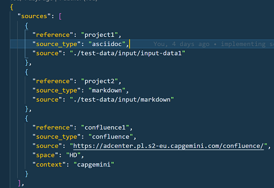
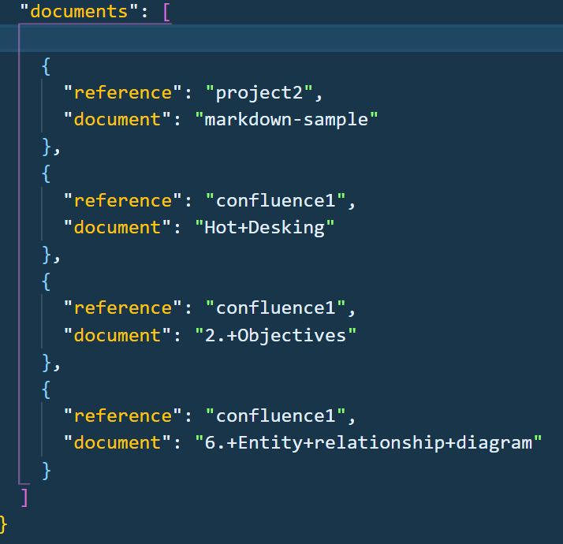

:toc: macro
toc::[] 

= COMPENDIUM

Compendium is a processor for generating, unifying and converting different sources like AsciiDoc files, Markdown files, Confluence and html websites in different formats.
We can select all the content or only parts of it and generate an AsciiDoc, Markdown, HTML or PDF.

== Tags covered in the IR (Itermediate Representation)

h1, h2, h3, h4, h5, p, a, img, table, ul, ol, code, br.
Inside a list: ul, ol, p, div, a, code.
Inside a table: p, img, table, span, ul, ol, a, code, div.

== Operating mode

For the definition of the programming interfaces have been developed for both the inputs and the outputs. +

==== Asciidoc input
image::./images/AsciidocInput.PNG[ASCIIDOC INPUT]

==== Confluence input
image::./images/ConfluenceInput.PNG[CONFLUENCE INPUT]

==== Asciidoc output
image::./images/AsciidocOutput.PNG[ASCIIDOC OUTPUT]

==== HTML output
image::./images/HTMLOutput.PNG[HTML OUTPUT]

== Technologies
This project uses different technologies. Here is a list of all of them:

* link:https://code.visualstudio.com/[Visual Studio Code] +
It's a great programme, because it can use in every SO and it's free. 
(Optional)

* link:https://nodejs.org/en/[NodeJS] +
Server-side development using the basics of the Express framework. It is a JavaScript runtime built on Chrome's V8 JavaScript engine. Node.js uses an event-driven, non-blocking I/O model that makes it lightweight and efficient. 

Open a terminal and in the project folder type :

    $ npm install -g ts-node
    $ npm i typescript -g
    $ npm install --ignore-scripts

=== VSCode extensions

* link:https://marketplace.visualstudio.com/items?itemName=joaompinto.asciidoctor-vscode[AsciiDoc VSCode extension] +
An extension that provides live preview, syntax highlighting and symbols for the AsciiDoc format. The preview uses Asciidoctor.js.
Toggle Preview - ctrl+shift+v (Mac: cmd+shift+v)

=== Node modules

This are the dependencies which are install with $ npm install automatically as we have already done:

* link:https://www.npmjs.com/[NPM] +
Node-Modules:
** yargs, interactive command line tool.
** asciidoctor, parser asciidoc/html.
** request, make http node request easier.
** extra-fs, a fyle-system module that works with promises and async/await.
** util, an easy way to convert callback functions in promises.
** chai and mocha, for unit testing.
** cheerio, parses markup and provides an API for traversing/manipulating the resulting data structure. We have use it in the url-html input as an easy way to find link tags.
** prompt, command-line prompt for node.js
** shelljs, is a portable implementation of Unix shell commands on top of the Node.js API. 
** html-parse, an HTML/XML parser that doesn't require valid HTML/XML. It's also meant to act as a sanitizer.
** htmlto, a Node module to convert HTML to PDF.
** turndown, a Node module to convert HTML to Markdown.
** showdown, a Node module to convert Markdown to HTML.

== Usage 

If you could installed Compendium successfuly run the following command in your terminal: 

    $ ts-node src/compendium.ts --version 

You should see the information about the Compendium version printed in the terminal. +
`0.9.0` 

Run the test to check Compendium works correctly: 

    $ npm test 

NOTE: see troubleshooting if experimenting errors

=== Command line interface (CLI)

The `compendium` command allows you to invoke Compendium from the command line. For a correct usage you need to introduce five arguments.

[source]

$ ts-node compendium.ts -f <config file> [--asciidoc|--html|--pdf | --markdown] <output file>

Options:

[source]
--version   Show version number
-f          Input type: JSON Config file (config file path)
--asciidoc  Output type: asciidoc file
--html      Output type: Html file
--pdf       Output type: PDF file
--markdown  Output type: MD file
-h, --help  Show help

Depending of the input type, you can use Compendium in different ways, since within this file you can do as much as asciidoc files, html urls and confluence pages. 

==== JSON Config file

To use Compendium a JSON Config file is needed. +
The file has two differentiated parts, the first part which contains the sources, and the second part, which contains the documents. +
First, we need to define the different sources, we can define as many sources as necessary. In this part, for each source we have three different arguments:

* reference: it refers the content in the file.
* source_type: (i.e asciidoc, markdown, html-url, confluence).
* source: It's the URL or PATH where the information is located. (i.e. https://adcenter.pl.s2-eu.capgemini.com/confluence/)

To read from confluence internal network we need to add this arguments to the source part:

* context: capgemini
* space: space key of the project, all the urls of the project have this letters. i.e.: (https://adcenter.pl.s2-eu.capgemini.com/confluence/display/HD/2.+Objectives ) space=> HD

To read from confluence private account:

* context: external
* space: depend on the account, all the urls have a two or three letters /<context>/.

On the other hand, we need to define the documents, as to the sources, we can have all the documents that are necessary. For each node we have three arguments also:

* reference: it refers the source reference, must be the same.
* document: It's the file name or name/id project (i.e 6.+Entity+relationship+diagram).
* sections: It's the section that you want to extract. If you want to extract all the content in the document you should leave this argument blank, but if you want to extract different sections, you should write in an array. (i.e sections: [h1, h3])

IMPORTANT: You can't write the same reference, each reference should be unique. And if you want to extract Confluence information you need to introduce your credentials to get the information.

===== Types of Inputs available

* Asciidoc documents: 
** source_type: asciidoc  (reads directly from local .adoc documents)
** source: Local Path.

* Markdown documents: 
** source_type: markdown  (reads directly from local .md documents)
** source: Local Path.

* Confluence pages:
** source_type: confluence 
** source: base url of confluence account
** context: capgemini (internal network) or external(private confluence account)
** space: JQ (project space key)

* Html pages directly from a website:
** source_type: url-html  
** source: url 
* In the url-html type the document part have an optional attribute: (document is an index, where we have to extract all the links from. And include them in the output file, so that we download all the pages from a site). The document has to be unique and consider the following:
** document: index url
** is_index: true or false (to indicate if we have to read an index)

===== Types of Outputs available

* Pdf 
* Html
* Asciidoc
* Markdown

==== Config File examples (mocks within the project folder test-data)

===== Example of Config File with diferent sources

Config file example with confluence and local asciidoc and markdown files:
test-data/input/configMix.json 
Command:
$ ts-node src/compendium.ts -f test-data/input/configMix.json --html out/out

===== Different examples with confluence/local files Input - pdf/html/asciidoc Output

This are the command and you can find the json files enclosed in this project:
[source]
$ ts-node src/compendium.ts -f test-data/input/configLocal.json --html out/out
$ ts-node src/compendium.ts -f test-data/input/configMix.json --pdf out/out
$ ts-node src/compendium.ts -f test-data/input/configSections.json --asciidoc out/out

===== Url html type Input - Html Output

Config file with several urls from handbook, config.json file example, the command:
[source]
$ ts-node src/compendium.ts -f test-data/confiles/html-url/config.json --html out/out

===== Url html type with is_index true - Html Output

Config file with a is_index true and a unique url document pointing at the handbook source.Have a look at the config.json file example, the command:
[source]
$ ts-node src/compendium.ts -f test-data/confiles/html-url/configAllIndex.json --html out/out

== Troubleshooting

There are no known errors yet.

== UML

image::./images/compendiumDiagram/compendiumDiagram.png[DIAGRAM]

