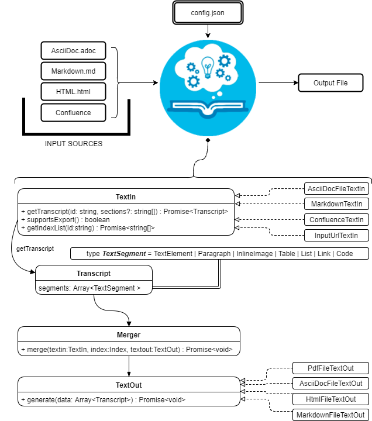

# COMPENDIUM
Compendium is a processor for generating, unifying and converting different input sources like [AsciiDoc](https://asciidoctor.org/docs/asciidoc-syntax-quick-reference/) files, [Markdown](https://guides.github.com/features/mastering-markdown/) files, [Confluence](https://confluence.atlassian.com/doc/confluence-wiki-markup-251003035.html) and HTML websites to different output formats. We can **select _all the content_** or only **_parts_ of it** from the input files and generate an AsciiDoc, Markdown, HTML or PDF as output.

## Operating Mode
Compendium uses a JSON Config file with two main parts that define where and how to get the desired unified output:

### Config JSON
#### Input Sources
Compendium currently accepts AsciiDoc, Markdown, Confluence and HTML as input formats.

In this part of the configuration file define the sources of the input files, the types and assign a reference id or name to them.
  - reference: id of the source.
  - source_type: (i.e asciidoc, markdown, html-url, confluence).
  - source: URL or PATH where the information is located. (i.e. https://adcenter.pl.s2-eu.capgemini.com/confluence/)
  ```
  "sources": [
    {
      "reference": "project1",
      "source_type": "asciidoc",
      "source": "./test-data/input/input-data1"
    },
    {
      "reference": "project2",
      "source_type": "asciidoc",
      "source": "./test-data/input/input-data2"
    },
    {
      "reference": "confluence2",
      "source_type": "confluence",
      "source": "https://adcenter.pl.s2-eu.capgemini.com/confluence/",
      "space": "JQ",
      "context": "capgemini"
    }
  ]
  ```
[x] To read from confluence internal network add this arguments to the source part:
  - context: capgemini
  - space: space key of the project, all the urls of the project have this letters. i.e.: (https://adcenter.pl.s2-eu.capgemini.com/confluence/display/HD/2.+Objectives ) space ⇒ HD
  
[x] To read from confluence private account add this arguments to the source part:
  - context: external
  - space: depend on the account, all the urls have a two or three letters / < context > /.
  

#### Documents and Sections
  - reference: it refers the source reference, must be the same (source id).
  - document: file name or name/id project inside source path referred (i.e 6.+Entity+relationship+diagram).
  - sections: section/s that you want to extract. If you want to extract all the content of the document you should leave this argument blank, but if you want to extract different sections, write them in an array. (i.e sections: [h1, h3])
  ```
  "documents": [
    {
      "reference": "project1",
      "document": "manual"
    },
    {
      "reference": "project2",
      "document": "brownfox2"
    },
    {
      "reference": "project2",
      "document": "paragraph1"
    },
    {
      "reference": "confluence2",
      "document": "Jump+the+queue+Home",
      "sections": ["Epic 2. Consult the queue"]
    }
  ]
  ```
### Types of Inputs available and parameters
- **AsciiDoc** documents:
  - source_type: asciidoc (reads directly from local .adoc documents)
  - source: Local Path.
- **Markdown** documents:
  - source_type: markdown (reads directly from local .md documents)
  - source: Local Path.
- **Confluence** pages:
  - source_type: confluence
  - source: base url of confluence account
  - context: capgemini (internal network) or external(private confluence account)
  - space: JQ (project space key)
- **HTML** pages directly from a website:
  - source_type: url-html
  - source: url
  In the url-html type the document part have an optional attribute: (document is an index, where we have to extract all the links from. And include them in the output file, so that we download all the pages from a site). The document has to be unique and consider the following:
    - document: index url
    - is_index: true or false (to indicate if we have to read an index)
### Types of Outputs available
- PDF
- HTML
- AsciiDoc
- Markdown

# COMPENDIUM Main Workflow
Compendium works like a merger and compiler. It gets pieces of information from different sources and formats, merges them into a single file and generate an output file with the desired output format (PDF, HTML, AsciiDoc or Markdown). 

In this section the main compilation and merging process is described:



## FRONTEND PROCESS
1. **Lexical** Analysis:
    - The sequences of characters from the input files are tokenized in the Scanner or **Tokenization** process.
    - **_TextIn_** objects transform the input source code to an HTML tokenized code using [**_Asciidoctor.js_**](https://asciidoctor.org) for the AsciiDoc files or [**_Showdown.js_**](http://showdownjs.com/) for the Markdown files. Confluence data is recovered via JSON and can be transcoded directly. Obviously, HTML files are already tokenized.
2. **Syntax** Analysis:
    - The HTML tokenized code is *parsed* to a Parse Tree in the **Parsing** or Hierarchical Analysis process.
    - **_TextIn_** objects parse XML (HTML) code using [html-parser](https://www.npmjs.com/package/html-parser) generating a **Tree datastructure** that represents the content. **_TextIn_** objects then go through all of the branches of the parsed *Tree* returning **_`Array<TextSegment>`_** elements that will be used to generate the **_Transcript_** objects.
    
