:toc: macro
toc::[]

= Accelerated Solution Design

== *Purpose*

The *purpose* of this Space is to *give a full overview of the set of activities, deliverables, tools and methods used at the AD Center to realize the Accelerated Solution Design (ASD) paradigm* .

The AD Center team shall customize those process, tools and methods for each project, depending on the type of project, its objectives, budget and planning, and the customer maturity.

The ASD is carefully designed to be a practical guideline that fosters and ensures the collaboration and communication among all team member. The members of the team involved in the ASD will be:

* Customer.
* Studio members, made up of UX Designer, Business Analyst and Architect
* Yard members, made up of Developers

Customers are key members of the team, as they understand the business and have needs and expectations, which the solution must fulfill. It is essential that customers get involved in the development from the beginning. Thus, the feeling of belonging the solution will be assured and the customer satisfaction will be improved. In addition to validating the solution and supporting all development phases.

Aiming for common understanding is crucial in this process and it is the main driver for ensuring that a *top quality solution* is provided. The best way to build shared understanding is by *validating* the assumptions. Hence, all the necessary stakeholders will be involved in the requirements elicitation, corresponding user story mapping and *prototype* creation.

The Accelerated Solution Design introduces a new type of *team* , which is broader, flexible and self-organized:

* The span of the team is *broader,* since *clients* are considered an important *part of the team* , a partner indeed. Customers shall have an active role in defining the user needs and validating the assumptions. In fact, they shall be consulted throughout the whole design and development processes.
* The team shall be *flexible* enough to adapt to unexpected changes, such as new requirements or the introduction of more roles in the development of the solution.
* Finally, each team member shall be *self-organized* . In other words, self-aware of their capacity and area of responsibility, able to organize their work and committed to ensure an efficient communication within the team.

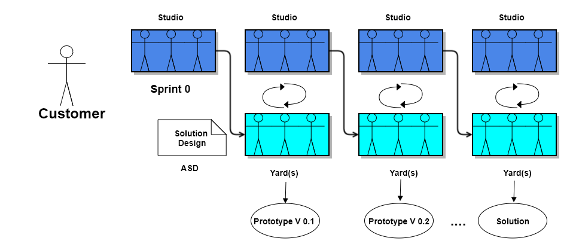

Summarizing, the Accelerated Solution Design is:

* A practical guideline rather than a “methodology”
* Based on industry standards rather than proprietary methods
* Consisting of an evolving, “living”, document set rather than a static, fixed document
* Encapsulating the business requirements, functional definitions as well as Architecture design
* Based on the intersection of Lean, Agile, DDD and User Story Mapping
* Based on the essential belief or paradigm that ASD should be
* Focused on the design (definition) of the “externally observable behavior of a system”
* Promoting comunication and collaboration between team members
* Guided by prototypes

== *Key principles*

The core principles of the Accelerated Solution Design are the following:

* Involve end users in the development life cycle
* Learn and apply continuous improvement
* Visualize
* Be iterative
* Improve communication and collaboration among team members (Customer, Studio and Yard)

The practices adopted at the AD Center to apply those principles are:

* Intersection of a selection of industry standard practices
* Lean
* Agile requirements flow

Next, those three practices are explained.

=== *1. Intersection of industry standard practices*

The ASD process will combine and apply the following industry standard practices:

* UX Design process through LEAN / Design Sprint (Google ventures)
* User Story mapping
* Domain Driven Design (DDD)

The final design (or rather “growing design”) emerges from the intersection of these three practices.

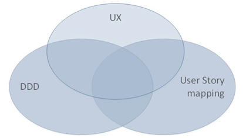

=== *2. Lean*

Using Lean discovery and design process model, the UX Designer, the Business Analyst and the Architect will work together to model and specify the design of the system and deliver to customer a product he desires much faster.

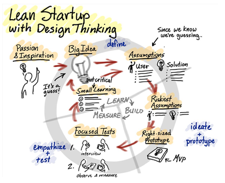

=== *3. Agile requirements flow*

The Business Analyst and UX Designer will follow the agile requirements flow below to perform the analysis of the required solution which shall fulfill the business needs.

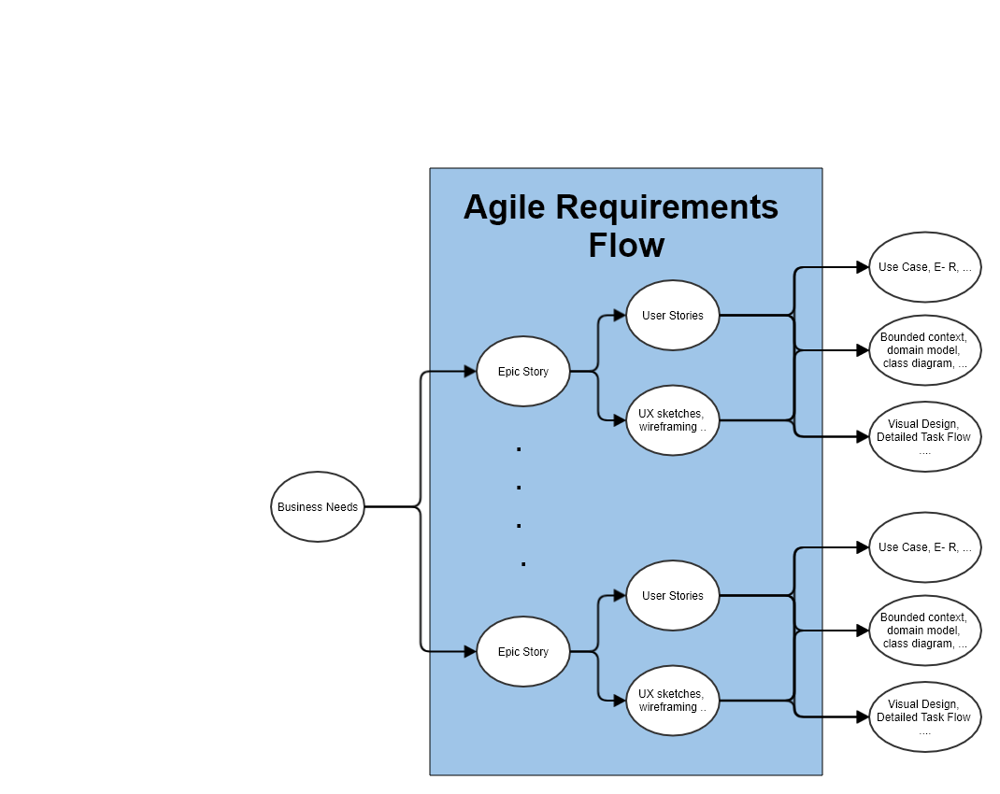

From the beginning, Business Analysts and UX Designers will work together with the Product Owner and users to understand the business needs.

Each business need will be documented as one or more Epic Story. Each Epic Story will be broken down into one or more appropriate user stories and required UX sketches and wireframing, which document the user interface and behavior of the solution.

The Business Analyst will discuss with the Project Owner and the Architect the modelling of the solution, using the User Stories as input for the discussion. At this point, the solution can be detailed with use cases, E-R, domain modelling, etc.

== *Ways of Working*

This chapter describes in detail the process to be followed at the AD Center to deliver the solution.

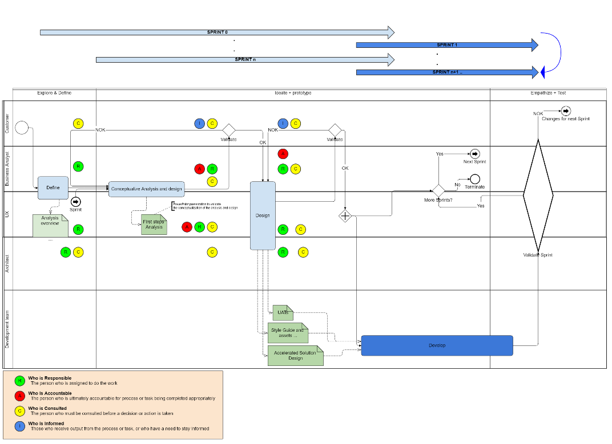

Following points explain in detail each phase.

=== *Explore and Define*

To ensure the success of the project, the team must understand the needs of the customer, why they are necessary and what is the Minimum Viable Product (MVP) that the solution should deliver.

At this stage of the development life cycle, it is necessary that the Business Analyst, UX Designer and Architect work together with project stakeholders to:

* Understand and examine the statement of purpose of the project, i.e. answer the WHY
* Collect the Business needs and objectives of the project. i.e. know the Minimum Viable Product to be delivered
* Define the Business requirements, i.e. determine WHAT must be provided by the solution
* Build the Glossary of Terms. It is important to define and clarify the vocabulary that is used by the customer and technical teams. This will avoid any misunderstanding in the future.

These are mainly analysis activities and are the starting point for Sprint 0, which is an Analysis and Design sprint.

==== Tasks

The main tasks of this phase are:

* _Define_ . Understand and describe the customer needs.

==== Inputs

Some inputs to perform the above tasks are:

* Project charter.
* Meetings held with main stakeholders.

==== Output

The main outputs of this phase will be the following set of documents:

* Analysis Overview.

=== *Ideate + prototype*

At this stage, the solution is designed and developed. To achieve that, each functionality, which are required to perform the required design and development sprints, will be prioritized.

As previously described, the AD Center will follow an agile requirement flow to analyze and design the solution (See link:#agile-requirements-flow[agile requirements flow] ).

To do this, the following sprints are proposed:

* *Sprint 0* (Analysis &amp; Design): Analysis and Design sprint that contains the requirements to be developed in the incoming development sprint. The duration of the sprint should not be more than two, three weeks and the expected output is the User Story mapping with the user stories to be developed. The tasks involved in this sprint are:
** Conceptualize Analysis and Design
** Design
* *Sprint 1* (Development): The Development team will use the User Stories and related documentation prepared in the preceding Analysis &amp; Design sprint to plan and execute the Development sprint.

Sprint 0 and 1 will be repeated until solution is completed and accepted by customer. The following iterations of Sprint 0 and 1 will be called n and n+1.

==== Tasks

The main tasks of this phase are:

* *Conceptualize analysis and design* .  The Business Analyst will work together with the UX Designer and customer to collect and document the requirements that fulfill the business needs. The requirements will be documented as epics and user stories, sketches and wirefraiming. In this task, the Business Analyst &amp; UX Designer will generate a common document (First Steps Analysis) to present and validate the results of the tasks with the customer.
* *Design* . Once the First Steps Analysis document is validated by customer, the members of Studio will work together to make a solution design document (Accelerated Solution Design), which covers user needs that were identied in Ideate + Prototype phase. Additionally, the whole team will work together with customer to document the user acceptance tests (UATs) to be fulfilled by the solution. This UAT document should be finished before the development task starts, so that it can be used by the Development team to understand what is the expected behavior of the application. And finally, the Style Guide and Assets shall be documented as well. All these documents will be the main input material for the Develop task.
* *Develop* . The Development team will start its sprint with the details collected in the previous tasks.

==== Inputs

* Analysis Overview
* Meetings held with Customer.
* Meetings involving different members of the Development team (UX Designer, Business Analyst, Architect and Developers).

==== Output

* First Steps Analysis
* Accelerated Solution Design
* UATs
* Style guide, assets, … (UX docs.)

=== *Empathize + Test*

This is the final stage of our model, but in an agile process, the results generated during the testing phase are used to redefine one or more problems and inform the understanding of the user, the conditions of use, how people think, behave, and feel, and to _empathize_ .

In this phase, the development will be validated by using some techniques:

* Integration Tests. Tests that validates the interfaces with other systems. They can be automated using an external software.
* Functional Tests. Tests that validates the functionality of the system. They can be automated using an external software.
* Regression Tests. Tests that validates that existing functionality of the system works and was not broken by the new change. They can be automated using an external software.
* UATs. User acceptance tests, they are used for validating that the solution fulfills the requirements. They describe the minimum criteria the customer will use to accept the solution. They are usually executed by the customer.

==== Tasks

* Validate Development Sprint.
* Empathize and propose improvements for the next Ideate + prototype sprint.

==== Inputs

* UAT definition.
* Tests definitions.
* Meeting with customer, Business Analyst, UX Designer, Architect and development team.

==== Output

* UAT results
* Test status
* List of proposed changes

== *Relationship with project Kick-off phase*

Accelerated solution design defines how we must work at AD Center to develop the solution that support the project scope.

As first steps, BA’s, UX and architect work together with project stakeholders to identify and define:

* Business needs.
* High level requirements.
* Identify initial technical architecture that will support the requirements.
* Identify project dependencies, assumptions, constraints.
* Risks.

This information will be necessary at project kick-off phase to describe among other the following information:

* Project Scope and out of scope.
* Work packages and its planning.
* Required resources (as human as technical)
* Project risks.

*As we can see, there is a strong dependency between kick-off phase and the initial task of Accelerated Solution Design* . For this, kick-off phase will be the trigger the starting of ASD sprint zero and its *explore &amp; define* step.  In this step, we will complete all required information of kick-off phase and when kick-off phase will be completed, Ad Center team should continue with the activities of Accelerated Solution Design. In parallel, project manager should supply the required resources, that were identifying at kick-off phase, to be able to continue with Accelerated Solution Design and the development of the solution.

== *Deliverables and RACI*

|==================
|  5+^| *ROLES* 
| *DELIVERABLE* | *CUSTOMER* | *BUSINESS ANALYST* | *UX DESIGNER* | *ARCHITECT* | *DEVELOPER TEAM* 
| *Analysis overview* | Consulted | Responsible, Accountable | Responsible | Responsible,Consulted |  
| *First steps Analysis* | Consulted, Informed | Responsible, Accountable | Responsible, Accountable | Consulted |  
| *Accelerate Solution Design* | Consulted | Responsible, Accountable | Responsible | Responsible | Informed 
| *UATs* | Consulted | Responsible, Accountable, | Consulted |  | Informed 
| *Style Guide, assets..* | Consulted |  | Responsible, Accountable |  | Informed 
|==================

=== *Analysis Overview*

This document shall provide the following information:

* Project introduction and Statement of purpose.
* Objectives of the purpose.
* Business requirements.
* Glossary of terms.
* Project Assumptions.
* Risk analysis.
* Dependencies.
* Constraints.
* …

The following link:https://github.com/jdiazgon/devon-methodology/blob/ASD_Practices/extracted-media/mediaASD/%5BProject%20Code%5D__%5BProject%20Name%5D_Analysis_Overview_v%5B1.0%5D_YYYYMMDD.dotx[document] shows sample content of this document.

=== *First Steps Analysis*

This document is used to present and validate the results of the analysis to and with customer.

The required content is:

* Actors that are involved in the process
* Details of the requirements that fulfill the business needs, in the form of Epics and User Stories
* Site map and sketches of the user interfaces that shall meet the requirements

The powerpoint template can be found at following link:https://github.com/jdiazgon/devon-methodology/blob/ASD_Practices/extracted-media/mediaASD/ADCenter_First_Steps_Analysis_Document_TEMPLATE.potx[link]

=== *Accelerated Solution Design*

This document, which is forwarded to Development team, describes in detail the expected behavior of the solution. It includes both functional and technical information.

The mandatory information described in this document is:

* Project introduction and statement of purpose.
* Objectives.
* User Story mapping. Epics and user story details.
* Site map and user interface design.
* Entity relationship diagrams.
* Bounded context.
* Glossary of terms.

It can optionally contain the following data:

* Class diagrams and anyother diagrams that help documenting the solution.

Click to access tolink:https://confluence.s2-eu.capgemini.com/display/ACM/Jump+The+Queue+Project[Accelerate Solution Design] sample

=== *UAT*

It defines the user acceptance criteria the solution must fulfill.

A sample template can be found at following link:

link:https://github.com/jdiazgon/devon-methodology/blob/ASD_Practices/extracted-media/mediaASD/UAT_Template_v1.xlsx[UAT_Template_v1.xlsx]

=== *Style guides, assets, … (UX docs.)*

This set of documents includes all UX designs (visual guides, types, colors, style guides, etc.) to be used by Developers to develop the solution.

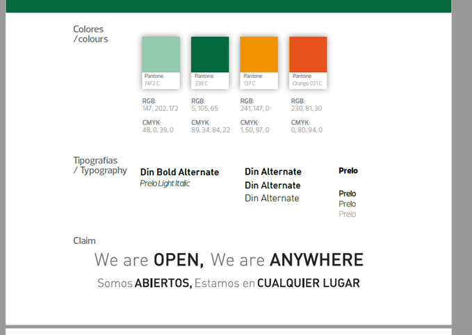

== *Design Process*

The design Process is part of the Accelerated Solution Design.  However, due to the big extension of this section, it has been described as a separated section which can be consulted link:design_process.adoc[here] .

== *Architecture Process*

=== *Overall Goals*

The goal of the Accelerated Solution Design is to create a document that is:

*Pre- and post-documentation*

The documentation was updated during and after the implementation: The implementation was governed by lean user stories created using the user story mapping method.

*Aligned to the implementation*

Structure, concepts and nomenclature should be close to the code.

*Allow for compact design documentation*

Much of the structuring of components and data should be presented at the Accelerated Solution Design deliverable and not need to be formally repeated in another documentation. The split of the application into components should be present in the code.

*Leanness*

The documentation should contain only the strictly needed information and should be very pragmatic.Easy to maintainIt should be versioned together with the code. A developer should be able to change it using only a text editor.

=== *Rationales*

==== *Purpose of the accelerated solution design deliverables*

The Accelerated Solution Design deliverables are not meant to be the basis of an implementation.

* They shall provide understanding of the system for maintenance and further development
* They shall refer to existing interface definitions wherever possible.

The level of detail of the doumentation is meant to provide understanding, but not all details of the system.

However, a certain level of detail was shown to be necessary for a thorugh understanding. Therefore, for example, the entities and their attributes are defined in the diagrams, but not in the tables.

==== *Level of proximity to the code*

The idea behind this documentation is to:

*be close to the code*

The documentation should be stored together with the source code and should be versioned alongside the code.

*be modular*

The contents of the different documented components need to be edited seperately.

*be orientated at the structure of the business components*

The modules of the documentation shall not follow the package structure of the code, but the chapter structure of the documentation.

The definition of the business components shall be close to the code: Components in this documentation should be represented as components in the code. This however, cannot be done in each case, especially not in the case of the angular gui.

* The angular components are very technically oriented. Basing the specification on these components would not result in a comprehensive document. Therefore, the documentation differs at least in this regard from the implementation.

==== *Creation of a ubiquitous language (DDD)*

The main goal is to enhance the understanding between the business departments and the technical staff. The main way of doing this is be specifying a language that will be uniformly used from the specification to the interfaces, the implementation and the tests. This includes not only entities and attributes, but also component names, subsystem and system names etc.

One difference is the usage of prefixes for the terms: These are only used in the business specification and not in the implementation itself.

==== *Level of detail of the documentation*

The level of detail differs depending on the customer and his requirements for the documentation of the implemented systems. However, a certain level of detail has proven to be useful for the business analysts who do not have regular access to the code:

* The attributes of entities should be present in the specification, both for interfaces and for database entities: The logic of the code often relies on these entities, and a specific reference to the required attributes is very beneficial for the precision of the documentation.
* The attributes do not need to be defined in the text: They may also be presented as an image.
* This image may also be technical, e.g. the export of a relational model in a database. Most readers can work with such diagrams, provided that some guidance is given for their interpretation. This is true both for database entities and for interface structures, e.g. for xml or json structures.
* …

==== *Specifics of the specification methodology*

The specification methodology is based on UML. It is based on the _Capgemini Specification Method_ and was tailored for the use as a post-documentation in agile projects. The usage of this method has led to a significant increase in in the quality and efficiency of the Capgemini software projects:

* Ramp-up times are reduced since the specification method is up and running in less time.
* The system specification can be completed quicker with fewer frictional losses.
* The quality of the system specification increases.
* The higher quality of the system specifications allows the depending disciplines design, implementation, test, etc. to be processed more quickly and efficiently and with higher quality.
* The Specification Method provides a structuring of the system that supports the project setup and handling in total.

The method is in detail described in the Specification Method manual.

==== *Selection of the tools and the storage*

The main focus of the tooling was

* to enable each and every member of the development teams to create and update content of the specifications by using easy to use tools.
* to keep the file sizes small in order to be able to version it together with the code.
* to keep the specification modular and thereby to prevent huge monolithic files.
* to keep the necessary installation effort as low as possible
* to use only open source products.

Because of this, asciidoc was selected for the creation of the document and plantuml was selected for the diagrams.

== *Tools*

=== *Confluence*

Confluence is a team collaboration software. It is developed and marketed by Atlassian.

Confluence is a simple, powerful wiki that allows groups or departments to share information. A wiki is a website that lets people collaborate and share information quickly ("wiki" is a Hawaiian word for "fast).  It is organized into collaboration areas called spaces which contact pages, attachments, and other types of content that can be viewed and edited by users.

The objective is that the deliveries will not a static document. It should be a dynamic document to which all team members have easy access.

*For this, confluence should be the repository where project documentation resides. Each documentation delivery will reside in confluence project space as pages to easily the maintenance, collaboration and access.*

=== *Jira*

Jira is a proprietary issue tracking product, developed by Atlassian. It provides bug tracking, issue tracking, and project management functions. The product name is a truncation of Gojira, the Japanese name for Godzilla, itself a reference to Jira&#8217;s main competitor, Bugzilla

Jira will mainly be used for:

* Creating and managing Epics and User Stories.
* Managing project tasks and resources.
* Managing issues.

As confluence and Jira are developed by Atlassian, the tools have native integration. So, it is possible to share documentation between them.

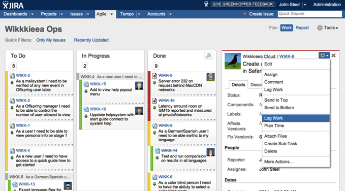

=== *PlantUML*

PlantUML is an open-source tool allowing users to create UML diagrams from a plain text language. It allows to quickly write:

* Sequence diagram
* Usecase diagram
* Class diagram
* Activity diagram (here is the legacy syntax)
* Component diagram
* State diagram
* Object diagram
* Deployment diagram
* Timing diagram

A PlantUML example:

@startuml
:user: --&gt; (Use case 1)
:user: -&gt; (Use case 2)
@enduml 

And the result:

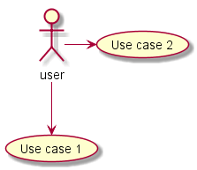

More documentation about it link:http://plantuml.com/[here] .

=== *GitHub*

GitHub is a web-based hosting service for version control using git (git is a version control system for tracking changes in computer files and coordinating work on those files among multiple people).

GitHub offers all of the distributed version control and source code management (SCM)
functionality of Git as well as adding its own features. It provides access control and several collaboration features such as bug tracking, feature requests, task management, and wikis for every project.

GitHub also handles *asciidoc* documents, so normally the documentation is either in asciidoc format or in .md (MarkDown). For example, this document uses asciidoc syntax.

=== *GitLab*

GitLab is a web-based Git repository manager (Git is a version control system for tracking changes in computer files and coordinating work on those files among multiple people) with wiki and issue tracking features, using an open source license, developed by GitLab Inc.

We currently use it because its repositories are *private* , while in GitHub everybody can see our code and projects.

=== *Enterprise Architect*

Sparx Systems Enterprise Architect is a visual modeling and design tool based on the OMG UML. The platform supports: the design and construction of software systems; modeling business processes; and modeling industry based domains. It is used by businesses and organizations to not only model the architecture of their systems, but to process the implementation of these models across the full application development life-cycle.

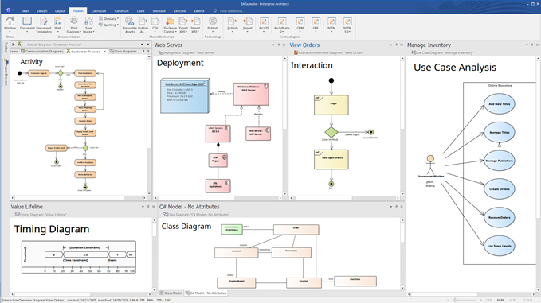

=== *Adobe Creative Cloud*

Adobe Creative Cloud is a set of applications and services from Adobe Systems that gives subscribers access to a collection of software used for graphic design, video editing, web development, photography, along with a set of mobile applications and some optional cloud services.

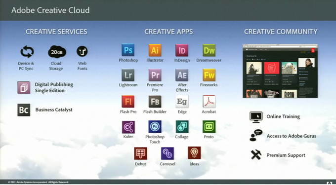

The design tools used in AD Center are *Axure RP8, Adobe XD, Adobe Photoshop* etc. Others desirable skills includes Graphic user interface (GUI), HTML, CSS, &amp; JavaScript

= Design Process

= Purpose

The purpose of this Document is to give a full overview of activities, deliverables, methods and tools per phase. Adaption for every project is needed depending on the type of project, objective, budget, planning, and customer maturity.

= Key principles

The key principles to consider in every phase of a project is: Involve end users Learn Visualize Be iterative Collaborate with client 

= Main Steps

The main steps in the way of working skeleton are: Explore &amp; Define Conceptualize Ideate Create Iterate Validate Design &amp; Development Continuous Improvement 

= Alignment with GV (Google Ventures) Design Sprint Method | RDV (Rapid Design Visualization)

Since the GV Design Sprint Method is an important method we need to align this method with our UX approach.
The way we see it is that we (can/will) use the GV Design Sprint Method during the concept phase to focus on specific design challenges, especially for coming to a first prototype (What needs to be in a MVP). It can be helpful because it shows stakeholders what it means to design applications, and second you have a complete prototype in a short amount of time that we can continuously expand. But also during further development new conceptualization is needed and design sprints can be used for this (or will it be research sprints to test the prototype). The first two steps of the UX approach and the Design Sprint Method have almost the same phases. They follow the principles of Research, Ideate, Create, Iterate and Validate.
The same explanation can be applied to the RDV or Rapid Design Visualization method. It also follows the principles of requirements compilation along with the business team, end users and developers, and then the Ideate, Iterate, Create, and Innovate wheel till we get a validated and complete design ready to deliver to development. The main difference in here is that, RDV approach usually uses the development team to create a working prototype into which the changes of the iterations are applied. With the help of the UX team, this prototype is quickly made with prototyping design tools such as Axure, Sketch, etc… making the changes in a minimum amount of time and without the need of complex coding and presentations. This also considerably reduces the overall development time. 

= Alignment with the full scale project

The UX process appears all over the timeline of a full scale project, but has stronger presence in the early phases.
Most of the times an assignment will not cover the entire design process, but only a part of it, therefore each step in this way has an end deliverable. This way we can offer the phases as building blocks, so that the client can decide what he wants us to do. We&#8217;ll represent here a full coverage example, Lean based. image::extracted-media/mediaDesign/image1.png[image1] 

= How we do | the steps to follow

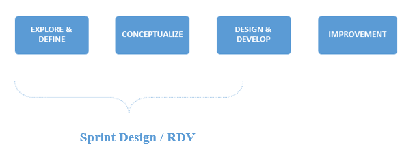 First of all, we need a couple of days to prepare all the material, templates and presentations we need to set the basis of our work. They can be physical assets like stationery, templates, continuous paper, etc. or online docs like PDF, Word and PowerPoint templates or videos. Adaption for every project is needed depending on the type of project, objective, budget, planning, and customer maturity.
It&#8217;s also important to create the multidisciplinary team who is going to work in the process, setting an initial schedule and a due date if we know it. This way of working works well remotely with the use of skype meetings and agile documents interchange in the main touch points of the process, but we strongly recommend that the first two steps being as face-to-face as possible, to get a complete immersion into the project and to achieve an optimal communication, often disrupted for things such as the language, bad connections and lack of visual acknowledgment. image::extracted-media/mediaDesign/image4.png[image4] 

== *1) Explore &amp; Define*

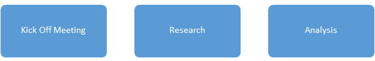

*End result*

The end result of this phase is a clear definition of the problem and a framework for the solution.

*Preferred Tools*

PowerPoint, Word, Google slides, Google docs.

*Team*

The Project Manager, Studio, Client and User.

*Global Documents*

*High Level Analysis* _(it can be a document or a group of documents)_

=== 1.1) Kick Off Meeting

*Input* : Initial requirements shared by the client, if any. *Process* : The initial meeting with the client, where input/requirement gathering happens. The UX designer and Business Analyst have to ask questions (about specifications/preferences) to the client to get the maximum feedback from the client. The minutes of the meeting will be documented. *Output* : *Debrief, Technical Capabilities* *&amp;* *Requirements Document* . The word document of the contents discussed in the meeting which includes the requirements from client side and their preferences and specifications.

*Team Shared Deliverables* : Requirements Document

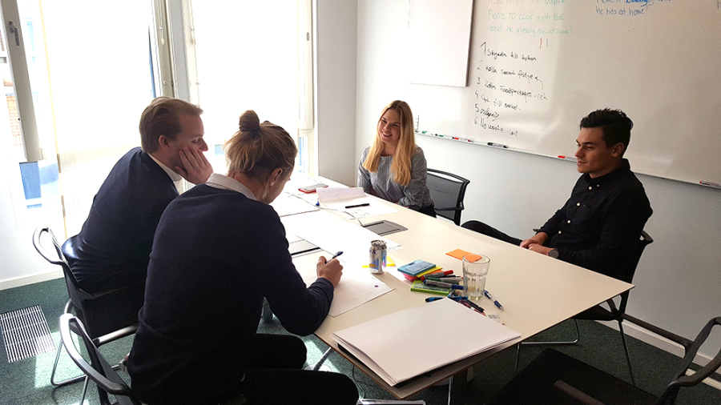

=== 1.2) Research

*Input* : Debrief, Technical Capabilities, User KPI, User interviews, shadowing, ethnographic analysis and objectives.

*Process* : Before we start designing a digital service, like an app, a website or an intranet, we need to understand the customer, his needs, his behavior and his environment. For this we will need to interview and observe them, but also use existing insights, like design trends, analytics and available research.

We also need to know the client&#8217;s business. We need to know their business goals (KPI&#8217;s), the business value they want to achieve and the current situation concerning technical and organizational capabilities (mapped to the needs of the customer).

*Output* : *Business Model Canvas, Benchmarking &amp;* *Review* *Report* . Understanding and documenting the current market trends and user expectations.

*Team Shared Deliverables* : Review Report

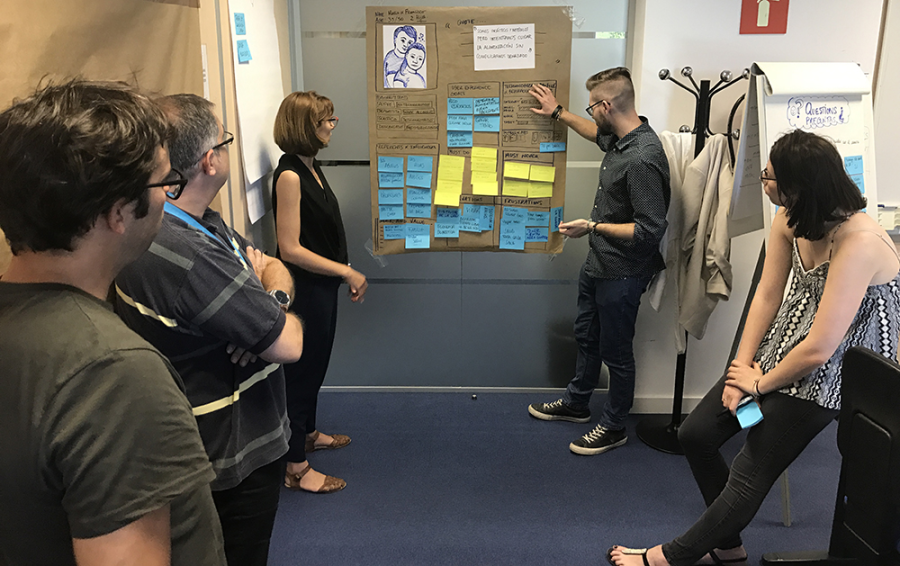

=== 1.3) Analysis

*Input* : Review Report &amp; Requirements Document.

*Process* : Analyze the input obtained from kick off meeting, research and team review, and find out how this product can give a competitive edge among the competitors in terms of user experience and what are the UX parts involved in this requirement to execute this project. Estimation of the UX process is also done in this stage.

It&#8217;s important to have a clear and uniform view on the challenges we need to solve (both of the customer and of the business). Visualizing these insights in persona&#8217;s, customer journeys, experience maps and maybe even infographics of the business and technology side will help with this.

Analysis stage includes creating personas, customer journeys maps, etc. In this stage, the UX team should do a thorough research on the current market for the product, user behavior and user expectations about the product.

The Persona is the representation of type of end user, who can belong to the customer organization or come from external user groups. The user research can be done by conducting online surveys, user interviews within or outside the organization; the market research can be done using online reviews and social media.

With the information obtained in these three phases, we will complete the High Level Analysis document together with the Business Analyst.

*Output: Personas, Customer Journey, Stakeholder Map, ­High Level Roadmap, Estimation &amp; Analysis Report*

*Team Shared Deliverables* : Estimation &amp; Analysis Report

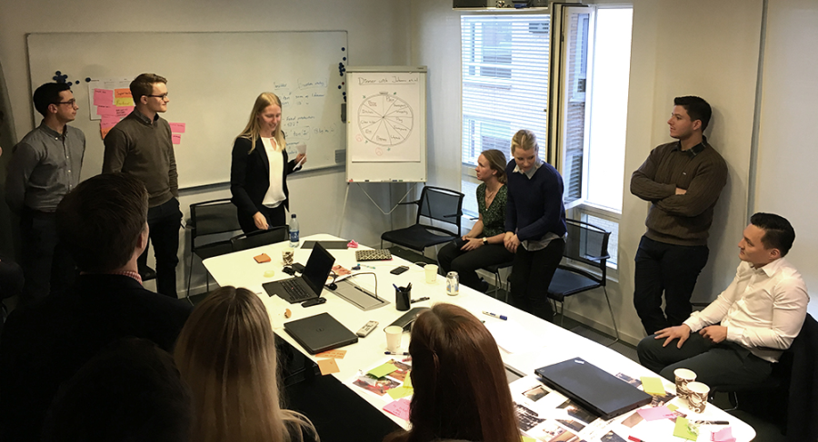

== 2) Conceptualize

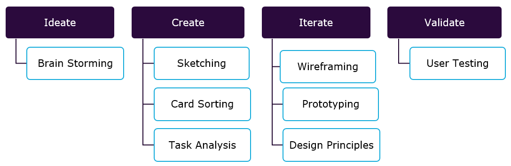 +

*End result*

The end result of this phase is a validated concept with brand/visual design vision, content strategy, interaction design guidelines and a proven technical solution to accelerate development. These deliverables help with the progress of designing the digital service.

*Description*

The main reason to have a concept phase separate from the detailed design is that it fits the type of project in which the client only wants to have a design, but we do not develop it.

*Preferred Tools*

Axure, Adobe XD, Illustrator, Photoshop, Sketch, Invision, POP, HTML5, CSS.

*Team*

Studio, client and user.

=== 2.1) Ideate

In this step we´ll start conceptualizing and drafting the solution. First, we need to get inspired to come up with ideas that are innovative and let customers be amazed (sparkle). We design the optimal flow for the customer within an app and/or web site that meets their needs and exceeds their expectations.

Besides involving end users and clients in every phase, it&#8217;s important that we do this together with the client. The process itself should also be a good experience to them, so that they enjoy working together with us to create the best digital part of their service.

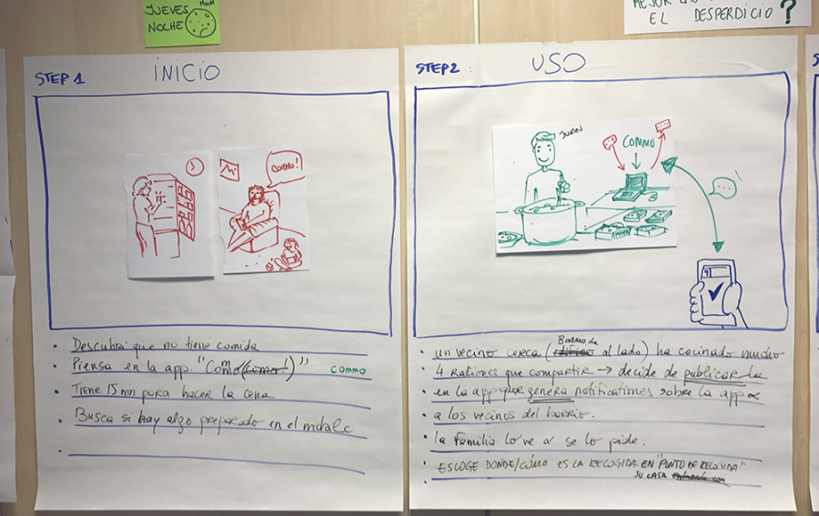

==== 2.1.1) Brain Storming

*Input* : The final High Level Analysis.

*Process* : After the project requirements are finalized, the UX team should have a brainstorming session, which is a deep thought process, where they will find the solution for 'how to convert the user requirements to a design'. In this stage, the UX designer will come up with set of solutions for converting/visualizing the project requirements to design interfaces for user interaction.

*Output* : The set of ideas which helps to transform the requirements into a design.

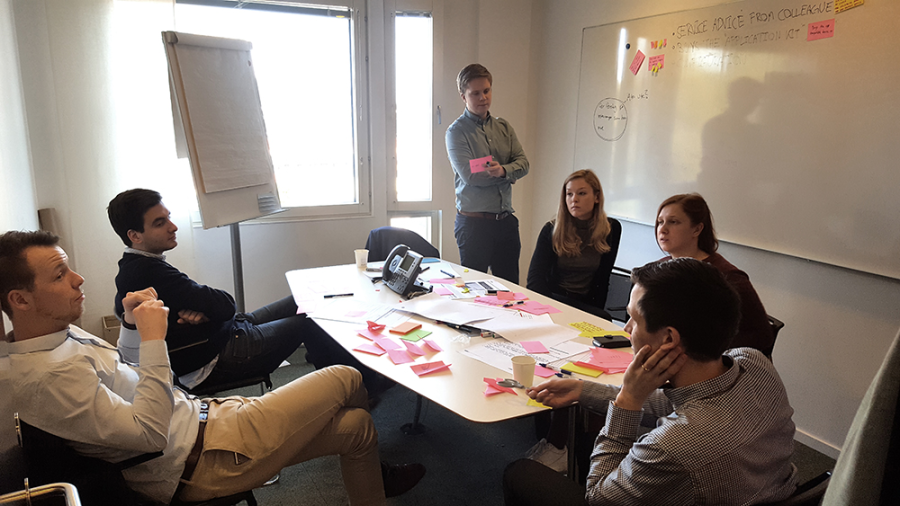

=== 2.2) Create

When the best idea has been chosen, the sketching starts together with business, technology and customers. Together we can translate an idea to a high-level concept on Interaction, Branding and Content, which everybody agrees on.

*Output* : Concept description, sketches, card sorting (task work flows and information architecture).

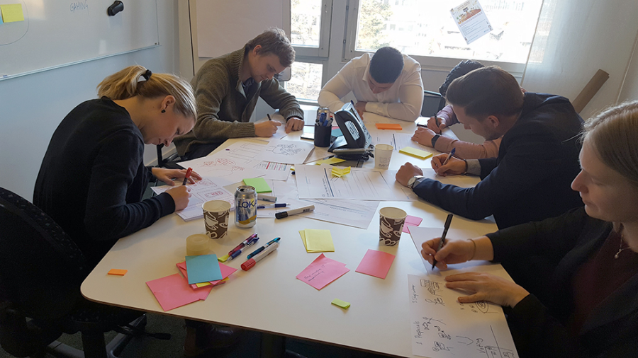

==== 2.2.1) Sketching

*Process* : In this stage, the initial sketching of the design is done. The output can be traced using a pencil and paper or using some rough sketching tools. The UX designers can work on different design styles to give multiple options.

*Output* : Initial sketching of the interface.

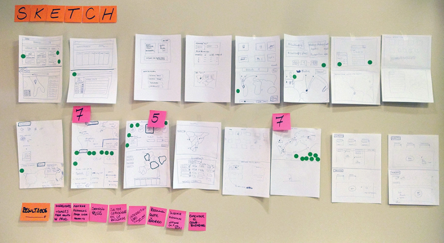

==== 2.2.2) Card Sorting: Defining an Information Architecture

*Process* : In a card sorting session, participants organize topics into categories that make sense to them and they may also help you label these groups. To conduct a card sort, you can use actual cards or pieces of paper. The purpose of Information Architecture is to structure, label, and organize the content. The UX designer has to do the story boarding/documenting the solutions obtained from brainstorming session. Through the information architecture, a UX designer finds out not only how each piece of the site fits together, but also how each item relates to all the other items within this structure.

*Output* : The hierarchy, information architecture, structure of each element of the interface for the user to interact.

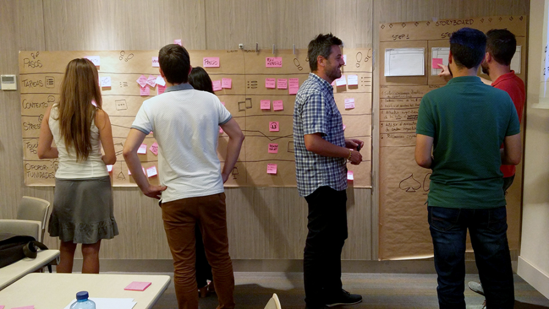

==== 2.2.3) Task Work Flow

*Process* :Task analysis identifies the actions and cognitive processes required for a user to complete a task or achieve a particular goal. In this stage, the tasks the user can perform on this interface and the tasks the system can perform should be identified.

*Output* : Task analysis report.

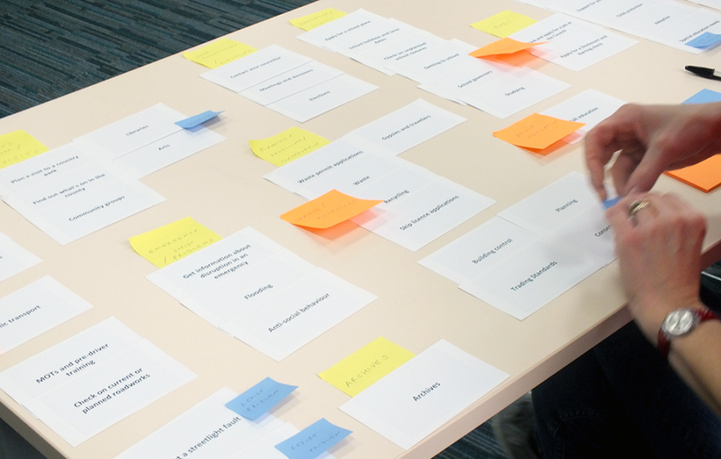

=== 2.3) Iterate

When the concept is clear we will create low fidelity wireframes and prototypes to visualize the requirements. This way there are no differences in interpretation possible and all stakeholders can agree on the same, this early in the process. Conceptualizing and designing has an iterative character in which we create, validate and improve.

*Output* : Wireframes, prototype, information architecture and design principles.

==== 2.3.1) Wireframing

*Input* : The sketching used as the reference

*Process* : The wireframing is the elaborated/detailed sketching of the design, it enables to deeper enter into the UX process and define in detail the user journeys before delivering the visual design part. The design also depends on the platform, so consideration needs to be made for different devices, operating systems, cultural behavioral differences (if it&#8217;s a global job). Mockup tools like Axure RP, iRise, Sketch or Adobe XD can be used to create wireframes. Several iterations can happen on this stage.

*Output* : Detailed wireframes of different pages.

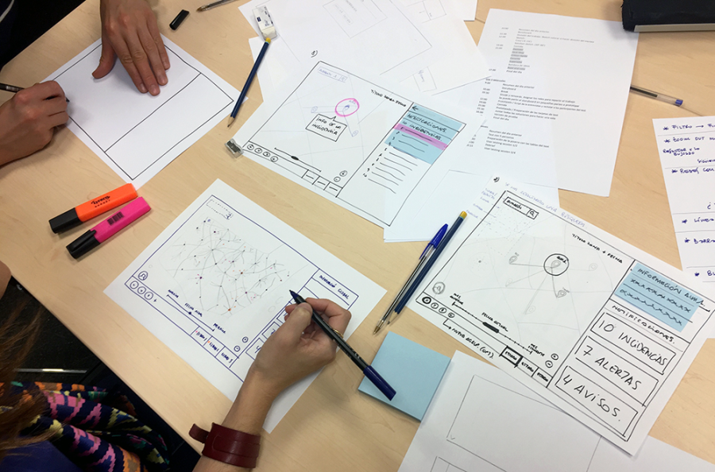

==== 2.3.2) Prototyping

*Input* : Wireframes, final requirement document and task work flow are the inputs

*Process* : The final version is detailed enough to start the detailing and development phase. Not everything will be described in a prototype but the most important flows, screens and the elements on the screen are defined, interaction and visual design. The details of each element are not final and will be defined in next phase, besides the rest of the screens and all alternative flows. This prototype is validated by customer.

*Output* : Low fidelity Wireframes, customer validated low fidelity prototype and high level information architecture.

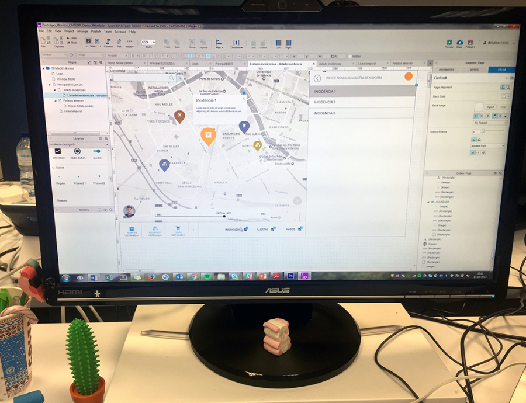

=== 2.4) Validate

Prototyping also enables us to test the app or website with end- users in an early stage. It&#8217;s important to involve customers (end users) to know as soon as possible if the concept is going to work.

*Output* : User testing results.

==== 2.4.1) User Testing

*Input* : Customer validated low fidelity prototype of the product.

*Process* : User testing / Usability testing refers to evaluating a product or service by testing it with real users. Users are asked to complete tasks, typically while they are being observed by a researcher, to see where they encounter problems and experience confusion. Usability testing lets the design and development teams identify problems before they are coded. The earlier issues are identified and fixed, the less expensive the fixes will be in terms of both staff time and possible impact to the schedule.

*Output* : User/Usability testing results and solutions for fixing the problems found.

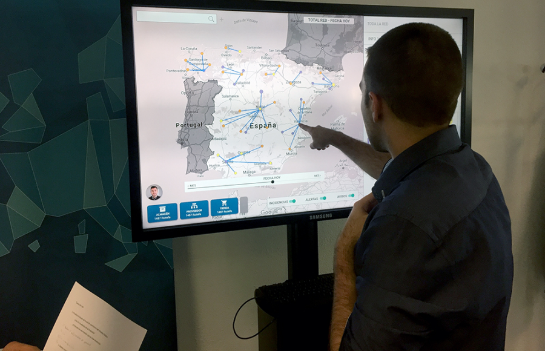

== 3) Design and Develop

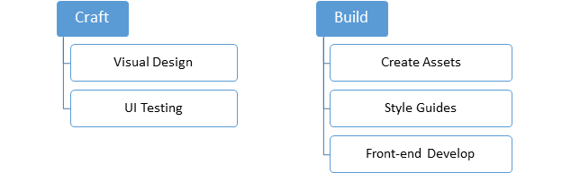

*End result*

The end result of this phase is the digital service itself. This can be in different variants. It can be an improved version of the existing channel, a Beta version or a Minimum Viable Product to start with.

*Preferred Tools*

Axure, Adobe XD, Illustrator, Photoshop, Sketch, Invision, POP, Sublime, HTML5, CSS.

*Team*

UX Designer(s), Development team, client and user.

=== 3.1) Craft

We combined the detailed design with the development, because all that you develop needs to be considered in the design.
Business involvement (customer meeting) is important at this stage as well, because the devil is in the details and a lot of questions and decisions will be made during detailing the design. Working closely together with business and development in this stage, is needed to offer the best digital service to the customer.

*Craft Output* : High fidelity wireframes and Analytics implementation plan.

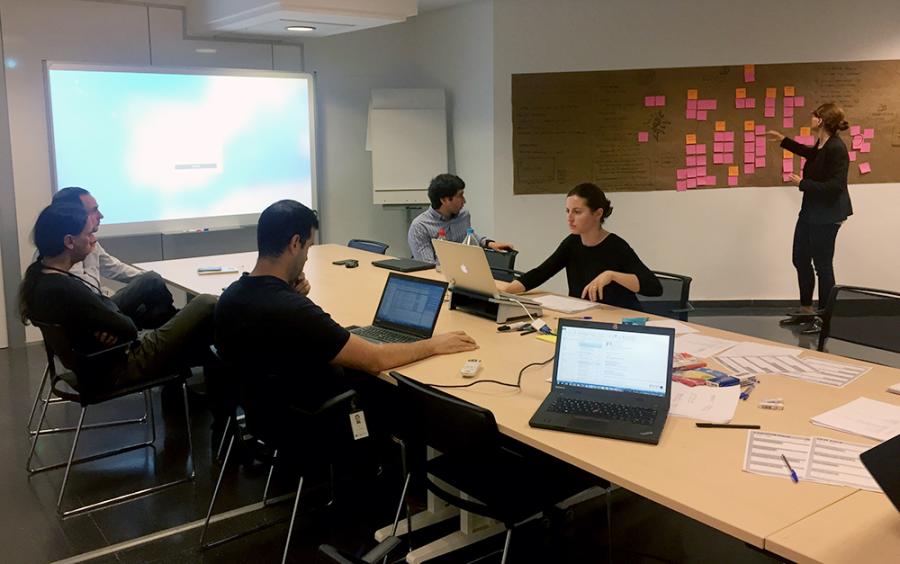

==== 3.1.1) Visual Design

*Input* : Final wireframes and prototypes, design principles.

*Process* : In this stage designers convert the wireframes to actual design. The specifications and branding guidelines from client has to be followed when creating visual design. This is the final design of the product and which will give an idea about how the final product will actually look like. Tools like Photoshop, Sketch or Adobe XD can be used to create visual design.

*Output* : Final, detailed and Hi fi Visual design and (if clients wants) microinteractions.

==== 3.1.2) UI Testing

*Input* : The final visual design screens.

*Process* : After creating the visual design, a user interface testing has to be performed. The design validation has to be done to check whether the design guidelines and specifications are followed properly and ensure the consistency and uniformity of the design of different pages.

*Output* : UI testing results of the visual design has to be documented. Changes or recommendations has to be noted and implemented as applicable.

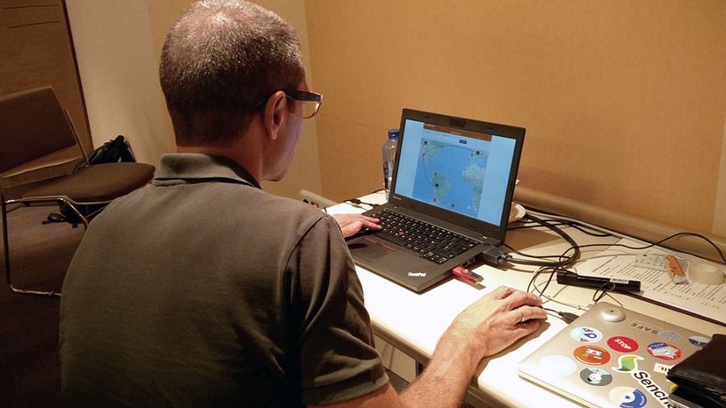

=== 3.2) Build

When we know the concept works, we will start designing the details with a multidisciplinary team, preferably in an agile process.

*Build Output* : MVP, HTML/CSS Layout, Mock ups, Style Guides, Visual assets and Content.

==== 3.2.1) Create Assets

*Input* : The final visual design screens.

*Process* : In this step designers create the assets required for development. It includes cropping of images and creating icons with proper specifications. Designers has to create design instructions for the developers to develop the page in line with the visual design.

*Output* : The assets required for development (cropped images, icons, design instructions etc.)

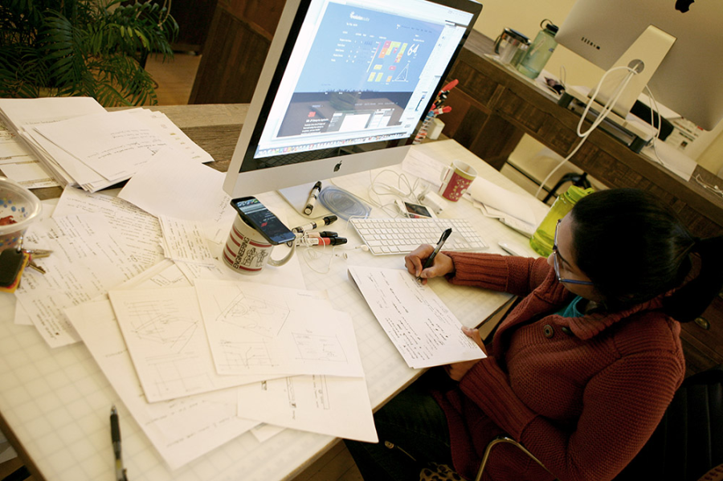

==== 3.2.2) Style Guides

*Input* : The final visual design screens, branding guidelines and front-end documentation.

*Process* : UI/UX designers need to deliver specs about each component of the project (buttons, menu, colors, typography etc.). They will explain animations, grid structures, interactions and component states, so that the developers can deliver the right outcome as efficiently as possible.

*Output* : Style guide with design specifications, guidelines and CSS description.

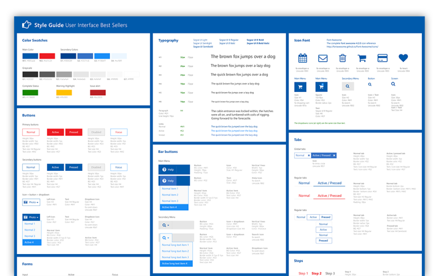

==== 3.2.3) Front-End Develop

*Input* : The final visual design screens, technical framework solutions and style guides.

*Process* : Front-end system integration to develop the user interface with the latest technologies. Working with HTML, CSS and JavaScript, also we use frameworks to speed up development construction.

*Output* : HTML/CSS Layout, themes and templates development.

== 4) Continuous Improvement

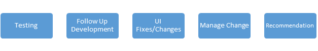

*End result*

The end result of this phase is an optimized version of the digital service based on data continuously.

*Preferred Tools*

Tobii (In progress), Skype, Quick Time, Google analytics, Google survey, Survey monkey, Google slides, Google form.

*Description*

After go live we&#8217;re not there yet. Actually, it&#8217;s just the beginning. Now we can learn and make changes to optimize the services we offer within the app, website or internal application to our customer.

Involving the customer in this optimization cycle, helps to build a relationship with that customer. We show that they are important to us, that we listen and we value their feedback.

*Output*

Analytics Dashboard (PPT, One slide all KPI&#8217;s), recommendation report, etc.

*Team*

The project Manager, UX Designer(s), Business Analyst, Development Team, client and user.

=== 4.1) Testing

Complete testing can help address issues and help the team to improvement the application. *Output:* A/B testing, remote testing, user feedback, surveys, analytics dashboard.

=== 4.2) Follow Up Development

Monitor the project throughout the development stage and give instructions and support to the developers.

*Output:* Design bugs report.

=== 4.3) UI Fixes/Changes

There are possibilities of UI bugs when implementing the design in development process, UI/UX designer should find out the issues and fix it.

=== 4.4) Manage Change Request

When a change request comes from client, the UX designer has to follow the design steps to implement the new changes without affecting the development process. Mockups and style guides has to be updated accordingly.

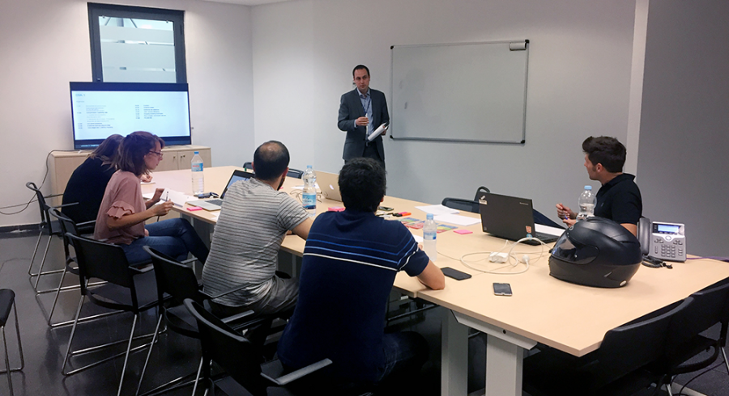

=== 4.5) Recommendations

As part of continuous improvement, the UX designers are free to suggest or recommend positive changes in design/workflow if it gives improved user experience.

*Output:* Recommendations and opportunities document.

= Jump The Queue Project

= *1. Project Introduction. Statement of Purpose*

Existing systems to manage queues and turns consists only in the assignation of a number without any associated logic that improves user experience and give value to user and to queue owner. Classic systems do not allow to know at what time will be each turn. In addition, clients only can consult queue status if he stays at the queue location. This provoke a bad user experience because he must to stay in the queue all waiting time. Besides, in an amount of cases, this causes that some users leave the queue because the long waiting time, provoking the loss of the sales. Ideally the users of the queue have to be able to know at what hour could be its turn. It is very important because he can improve its time and he will need to wait in the queue and only go when its time reaches. Besides, to facilitate that the user has not to be in the queue waiting its turn, he can consult the queue status at any device that he can have. (for example a mobile phone, tablet,  ..) As value added, queue owners will be able to prioritize users at the queue to have the possibility of creating marketing campaigns. A successful solution would be to improve user experience facilitating that the user has not to be in the queue waiting its turn. 

= *2. Objectives*

The objectives of the project are: Eliminate the needed of stay waiting in a queue. Improve user experience, easing the access to the queue. The system has to be simple and easily scalable and extensible 

= *3. First Steps Analysis*

This is the link:///171124_ADCenter_JTQ_First_Steps_Analysis_Document_V1_3.pptx[First Steps Analysis] presentation used to present and validate our understanding of the User Stories and behaviour of the future solution with customer.

= *4. User Stories*

The first objective of Jump the Queue component is to improve the time management of the user, providing the needed functionalities to do so. The solution focus on this premise and has to facilitate the process of accessing and consulting to the queue. Roughly, the entire process that a user will follow to obtain and consult the access code of a queue will be: image::media/ProcessMap.png[ProcessMap] The main actors that will interact with jump the queue component will be the following: -      User: It is an internal user of the external system that creates the queue and it will have privilege access to the queue. -      Visitor: User of the queue component that does not exist in the external system that created the queue. -      Owner: User that manages the queue. In the next points, we can see the details of the user stories that define the minimum functionality of Jump the Queue component. We can see the proposed user story map at the following figure. image::media/UserStoryMap.png[UserStoryMap] 

== *Epic 1. Get a number*

This epic contains all needed functions that allow users to get a number for entering in the queue.

As part of the process, the epic must implement:

1º Accept terms &amp; conditions.

2º Register in the queue. As part of this process the component must validate the information.

3º Obtain the code to access the queue.

The user stories that define this are:

=== User story 1. Accept terms &amp; conditions

|==================
| Story Narrative | Accept terms &amp; conditions | Priority | 5 
| As | visitor | Size |  
| I need to | accept terms and conditions | Dependency |  
| So that | I can access jump the queue system |  |  
| Acceptance Criteria a| * Terms and conditions will be configurable and the system must show this text.
* The system will ask to accept terms and conditions before getting an access code.
 |  |  
|==================

=== User story 2. Verify information

|==================
| Story Narrative | Verify information | Priority | 5 
| As | visitor | Size |  
| I need | my telephone number or email to be verified | Dependency |  
| So that | their validity will be confirmed |  |  
| Acceptance Criteria a| * User has to receive an email or a SMS with a validation code.
* The system will only allow the access to users that input this validation code.
 |  |  
|==================

=== User story 3. Consent information

|==================
| Story Narrative | Consent information | Priority | 1 
| As | visitor | Size |  
| I want to | give my permission for the use of my personal information | Dependency |  
| So that | I can received commercial notices |  |  
| Acceptance Criteria a| * This functionality can be activated or de-activated.
* If the user gives its permission, the system must save this information.
 |  |  
|==================

=== User story 4. Register

|==================
| Story Narrative | Register | Priority | 10 
| As | visitor | Size |  
| I want to | register to obtain an access code for the queue | Dependency |  
| So that | I get an access code |  |  
| Acceptance Criteria a| * User can inform a phone, email and a Name.
* The name is mandatory.
* The phone or the email have to be informed.
* The phone or the email have to be confirmed.
* The access code will be formatting as "Q" plus a number between 0 to 999.
* The access code will be the next free number. If the number reaches 999, the number continues with 0.
* The email, phone cannot be repeated in more than one non-attended turns.
 |  |  
|==================

=== User story 5. Priority access

|==================
| Story Narrative | Priority access | Priority | 5 
| As | internal user | Size |  
| I want to | get priority access code to the queue | Dependency |  
| So that | I will be attended earlier |  |  
| Acceptance Criteria a| * The access code will be formatting as "A" plus a number between 0 to 999.
* The access code will be the next free number. If the number reaches 999, the number continues with 0.
 |  |  
|==================

== *Epic 2. Consult the queue*

It contains all functions that permit to order and to consult the status of the queue.

The user stories that define this are:

=== User story 6. Consult Queue

|==================
| Story Narrative | Consult queue | Priority | 10 
| As | visitor or internal user or jump the queue owner | Size |  
| I want to | consult the status of the queue | Dependency |  
| So that | I would know when it is my turn |  |  
| Acceptance Criteria a| * The system only returns the non-attended turns of the queue.
* The list will be ordered by the time when the ticket was taken, except in the case that the access code will be of the form "A" + number that will be first (priority access).
* The list must return the following information: Access code, estimated time and Name.
* The user can consult the status of the queue although he has left of the system.
 |  |  
|==================

=== User story 7. Waiting time

|==================
| Story Narrative | Waiting time | Priority | 10 
| As | visitor or internal user | Size |  
| I want to | see my estimated waiting time | Dependency |  
| So that | I would know when I will be attended |  |  
| Acceptance Criteria a| * The system has to calculate the estimated time with the following formula: current hour + (Sum(The last ten attention time)/nº of attended turn counted)*(number of non-attended turns in the queue before this).
* The number cannot be less than a configurable value.
* The attention time is the difference between the start time and the end time.
 |  |  
|==================

== *Epic 3. Manage queue*

It contains all functions that allow to manage the queue in order to configure and attend active turn.

The user stories that define this are:

=== User story 8. Configure queue

|==================
| Story Narrative | Configure queue | Priority | 5 
| As | jump the queue owner of the queue | Size |  
| I want to | personalize the logo and description showed to users | Dependency |  
| So that | I can personalize my business |  |  
| Acceptance Criteria a| * The system allows to configure a logo and description.
* Jump the queue front shows the logo and description
 |  |  
|==================

=== User story 9. Attend queue

|==================
| Story Narrative | Attend queue | Priority | 10 
| As | jump the queue owner of the queue | Size |  
| I need to | know the current turn of the queue | Dependency |  
| So that | I can attend it |  |  
| Acceptance Criteria a| * The turn has to be the first in the queue that is non-attended.
* The system must save:
** At the previous turn: Save the current time as end time
** At the new turn: Save the current time as start time
 |  |  
|==================

= *5. Site Map*

We proposed the following sitemap and screens structures to support the requirements that must fulfill the solution. image::media/SiteMap.png[SiteMap] 1º Select Queue. This step will not be a screen and represent the operation that a user will follow to enter to Jump the Queue. 2º Request/ Insert code. This functionality represents the process that a user has to follow to obtain a ticket number. The proposed screen will only apply to visitors users because existing users will have a direct access to step 3. image::media/InsertCode.png[InsertCode] 3º Assigned Order / Show Queue. Here, the user can consult its number and the list of people in the queue. image::media/ShowQueue.png[ShowQueue] Finally, the owner of the queue can consult and pass the turn with the consult screen and with a button at the screen or pressing a physical button. image::media/ServeQueue.png[ServeQueue] 

= *6. Entity relationship diagram*

Starting from the list of user stories, we found the below entities to support them. image::media/ER.png[ER] Each entity will content the following information: 1. Visitor Information It contains the personal information of the visitors who gave the permission to use it. Attribute Type Name String Telephone TelephoneType Email EmailType 2 Terms and conditions It describes the Terms and conditions that the user must accept to use the queue. Attribute Type Description String 3 Queue owner It contains information for the users that can manage queues. Attribute Type User userIdType Name String Email EmailType Password PasswordType 4 Queue It contains the information that describes a queue. Attribute Type Description String Logo Image 5 Access code It contains the list people that are in the queue and their information.. Attribute Type Id_code String. Assigned code. PK Name String Email EmailType Telephone TelephoneType CreationTime Time (HH:MM). The hour when the user got the turn StartTime Time (HH:MM). The hour when the attendance of the user starts EndTime Time (HH:MM). The hour when the attendance of the user ends EstimatedTime Time (HH:MM). The hour which the system estimated when the user will be attended 

= *7. Bounded context*

In this point, we will define the bounded context of the final solution. In the figure below we have three domains, one for each related Epic. Obtain Access code domain: As we saw at epic chapter, this domain contains the required logic to get a turn in the queue. The related entities are: Access code: It is shared with Consult queue status domain. Queue: It is shared by the three domains. Personal information Terms and conditions: This is shared with Manage queue domain. Consult queue status domain: It has the needed logic to check turn status. This is supported by the entities: Access Code: It is shared with Obtain access code domain. Queue: It is shared by the three domains. Manage queue domain: This domain contains all functionalities to configurate the queues and their owners. Queue: It is shared by the three domains. Terms and conditions: This is shared with Manage queue domain. Queue owner. image::media/BoundedContext.png[BoundedContext] 

= *8. Glossary of terms*

Term Description Access code This is the turn number assigned to a person. Validation code It is a code used to confirm the validity of the email or telephone number informed by the user Estimated time Stands for the time that the system calculates when the person in the queue will be attended Attention time This is the time that it takes for a user to be attended. It is calculated as the difference between the start and the end of the attention Priority access It is the access granted to privileged users so they can be attended earlier 

